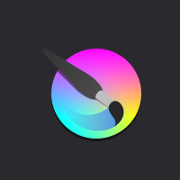

# Software packages — full workflow index

Every tool in the [professional pipeline](../../professional-workflow/pipeline-stages.md) has a **package card** with official sites, logos, and **verified training video links**.

## All packages

- 

    **[PureRef](pureref.md)**

    Reference boards · stage 0

- 

    **[Blender](blender.md)**

    **USE NOW** · modeling through export

- 

    **[Maya](maya.md)**

    Industry rig & animation standard

- 

    **[ZBrush](zbrush.md)**

    High-poly creature sculpting

- 

    **[TopoGun](topogun.md)**

    Dedicated retopology tool

- 

    **[Substance Painter](substance-painter.md)**

    PBR texture authoring

- 

    **[Mari](mari.md)**

    Film/VFX texture painting

- 

    **[Material Maker](material-maker.md)**

    **USE NOW** · procedural OSS textures

- 

    **[Krita](krita.md)**

    Free 2D paint & finish

- 

    **[Photoshop](photoshop.md)**

    Industry 2D compositing

- 

    **[Marvelous Designer](marvelous-designer.md)**

    Cloth simulation & garments

- 

    **[Marmoset Toolbag](marmoset-toolbag.md)**

    Lookdev & presentation

- 

    **[Second Life](second-life.md)**

    Upload, Animesh, in-world delivery

---

## By pipeline stage

| Stage | Professional | Free / OSS | Card |
|-------|-------------|------------|------|
| References | PureRef | PureRef personal / boards | [PureRef](pureref.md) |
| Modeling | Maya | **Blender** | [Maya](maya.md) · [Blender](blender.md) |
| Sculpt | ZBrush | **Blender** | [ZBrush](zbrush.md) · [Blender](blender.md) |
| Retopo | Maya · TopoGun | **Blender** | [TopoGun](topogun.md) · [Blender](blender.md) |
| UV | Maya | **Blender** | [Blender](blender.md) |
| Bake | Substance · Marmoset | **Blender** | [Substance Painter](substance-painter.md) · [Marmoset](marmoset-toolbag.md) · [Blender](blender.md) |
| Texture paint | Substance · Mari | Blender · **Krita** | [Substance](substance-painter.md) · [Mari](mari.md) · [Krita](krita.md) |
| Procedural | Substance Designer | **Material Maker** | [Material Maker](material-maker.md) |
| 2D finish | Photoshop | **Krita** | [Photoshop](photoshop.md) · [Krita](krita.md) |
| Cloth | Marvelous Designer | Blender | [Marvelous Designer](marvelous-designer.md) |
| Rig / anim | Maya | **Blender** | [Maya](maya.md) · [Blender](blender.md) |
| Lookdev | Marmoset | Blender · SL | [Marmoset](marmoset-toolbag.md) |
| Delivery | — | — | [**Second Life**](second-life.md) |

**Bold** = Breedables Studio **USE NOW** path where applicable.

→ [All training videos by stage](../../resources/training-videos-by-stage.md)  
→ [Complete workflow courses](../../resources/complete-courses.md)  
→ [Software page standard](../software-page-standard.md)
